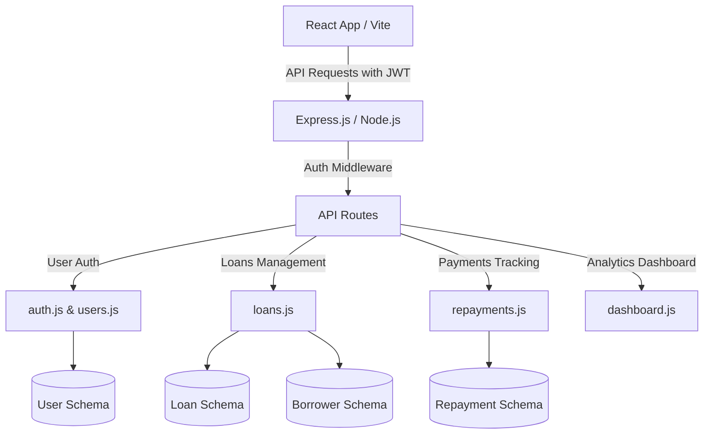

# Agent State & Project Progress Tracker

This document tracks the active state, implementation tasks, architectural decisions, and current progress for the **Village Microfinance Platform** project.

---

## 📌 Project Overview
Village Microfinance is a MERN stack web application built for rural microfinance lenders to securely digitize borrower profiles, manage loan lifecycles, and track repayments.

- **Stack**: MongoDB (Mongoose), Express.js, React.js (Vite), Node.js, JWT Authentication
- **Roles**:
  - `admin`: Manages staff users (Lenders, Loan Officers) and bootstrap.
  - `lender`: Can create borrowers and submit loan applications.
  - `officer`: Reviews, approves, rejects, and manages loan applications and repayments.

---

## 🗺️ System Architecture

---

## 📋 Implementation Checklist

| Task | Description | Status | Files Involved |
| :--- | :--- | :---: | :--- |
| **Task 1.1** | Create React component for borrower profile form with validation and errors | ✅ Done | `Frontend/src/components/BorrowerForm.jsx` |
| **Task 1.2** | Implement backend Borrower schema and REST endpoints | ✅ Done | `Backend/models/Borrower.js`, `Backend/routes/borrowers.js` |
| **Task 1.3** | Protect routes with JWT authentication middleware | ✅ Done | `Backend/routes/borrowers.js` |
| **Task 1.4** | Connect Frontend state and tie component submit to protected endpoint | ⏳ Pending | `Frontend/src/App.jsx` |
| **Task 2** | Implement Repayments Logic & APIs | ⏳ Pending | `Backend/models/Repayment.js`, `Backend/routes/repayments.js` |
| **Task 3** | Dashboard & Analytics API | ⏳ Pending | `Backend/routes/dashboard.js`, `Backend/server.js` |
| **Task 4** | Complete Frontend Authentication & State Management | ⏳ Pending | `Frontend/src/App.jsx` |
| **Task 5** | Build Borrower Management UI | ⏳ Pending | `Frontend/src/components/`, `Frontend/src/App.jsx` |
| **Task 6** | Repayments UI and Stats Dashboard | ⏳ Pending | `Frontend/src/App.jsx` |

---

## ⚡ Developer Notes & Configuration
- **Database Name**: `microfinance`
- **Environment variables needed**:
  - `PORT` (Default: 5000)
  - `MONGO_URI` (Default: `mongodb://127.0.0.1:27017/microfinance`)
  - `JWT_SECRET` (Key for signing auth tokens)
  - `SMTP_HOST`, `SMTP_PORT`, `SMTP_USER`, `SMTP_PASS` (Optional, for onboarding emails)
